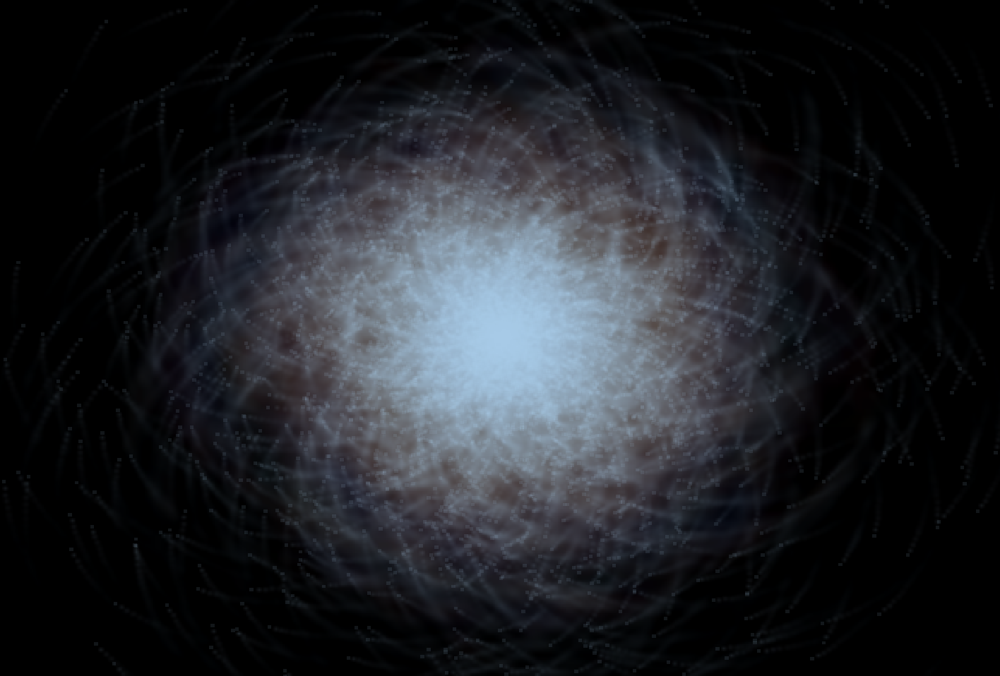
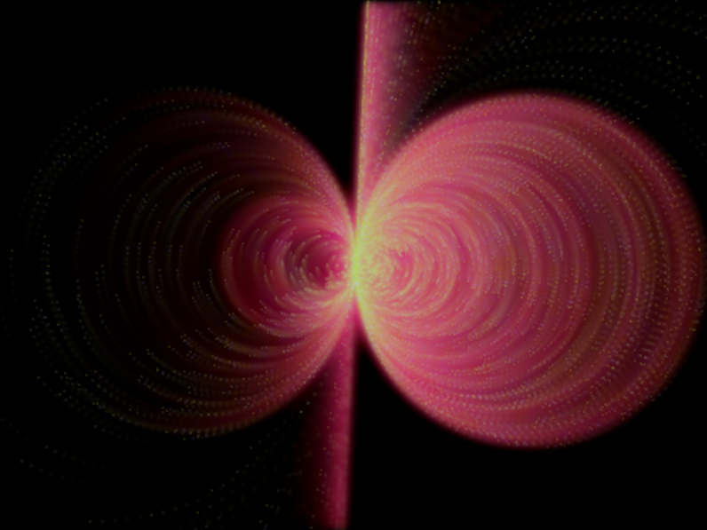
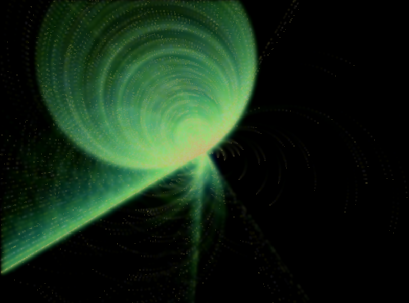

# Particle-Explosion

Creating a simple particle explosion using C++ SDL API

## Requirements to run on Local Machine

- g++ 7.5.0
- SDL2.0 C++ API
`sudo apt-get install libsdl2-dev`
- `make`
- `./run`

you can play around this by tweaking the motion of particles

## Preview

## Have Fun!
By just changing the various mathematical functions used such as `sine`, `cosine` ,`tangent` etc you can create different patterns.
such as

